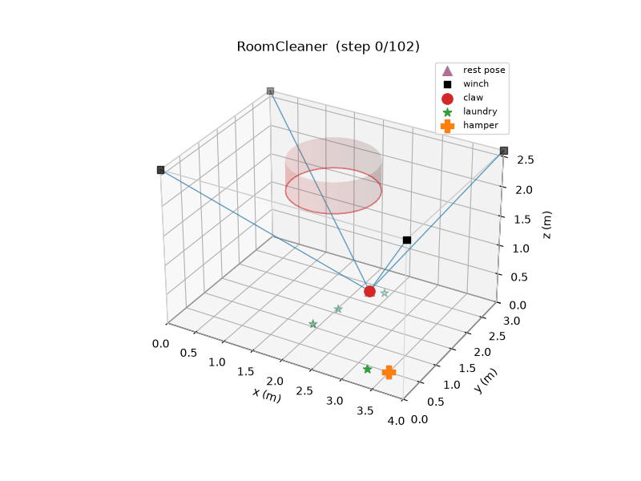
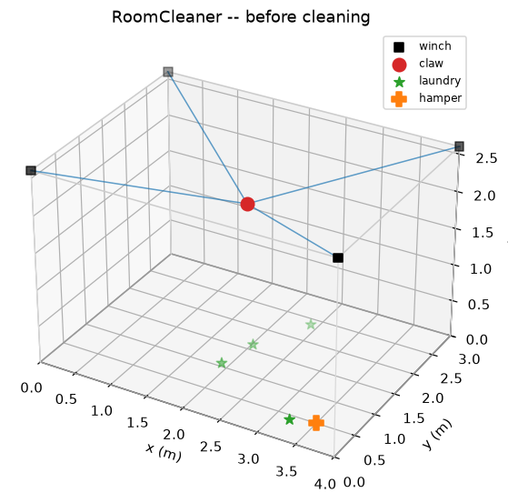
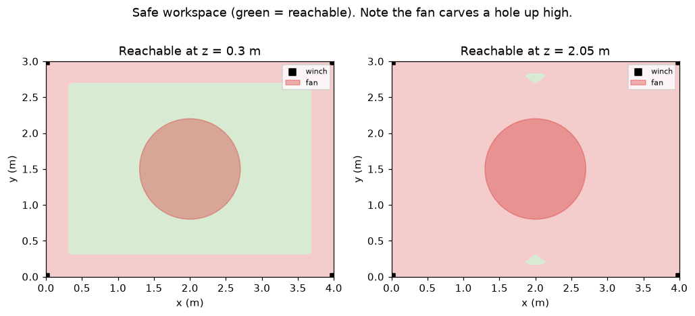

# RoomCleaner 🧺🤖

An autonomous robot that scans your room, spots dirty laundry on the floor,
picks it up, and drops it in the hamper — using four winch motors in the
ceiling corners and a downward-facing gripper on cables.

> **Status:** Phase 0 complete + Phase 1 scaffolded. The kinematics, fan-aware
> motion planning, auto rest-pose, and the full scan→grab→deliver loop run today
> with **zero hardware**; a real open-vocabulary laundry detector runs on a
> webcam. You only need to fill in your room dimensions and ceiling-fan location.



---

## The idea in one picture

The machine is a **Cable-Driven Parallel Robot (CDPR)** — the same mechanism
that flies the "SkyCam" over a football stadium. Four motorized winches sit in
the ceiling corners; each pays out or reels in a cable. Where the cables meet is
the end-effector (the "claw"). Control the four cable lengths and you control the
claw's position anywhere in the room.



**Why a cable robot instead of arms or a rolling vacuum?**
- It reaches the *whole floor* from above — no bumping into furniture.
- The heavy motors stay bolted to the ceiling; only a light claw moves.
- The math (below) is clean and the parts are cheap.

The trade-off is the reachable area shrinks near the walls (cables can't pull the
claw sideways into a corner). Here's the safe workspace at a low height — green is
reachable, pink is not:



That pink border is a real design constraint: **laundry pushed right against a
wall is a hard case** we'll have to handle (e.g. a longer-reach end-effector, or
just accepting a small dead-zone).

### The ceiling fan is a hard no-go zone
If you have a ceiling fan, the robot's cables must **never** touch it. RoomCleaner
models the fan as a vertical keep-out cylinder and geometrically checks *every
cable* against it — a point is only reachable if all four cables clear the fan and
the claw stays out of it. The claw also **cruises below the fan** and **parks at
an auto-computed rest pose** out of the way between jobs. You just enter the fan's
center, blade radius, and how far it hangs down; the math does the rest. Good
news from the workspace map: laundry *under* the fan is still reachable, because
when the claw drops low the cables splay out to the corners and clear the blades.

---

## Quick start

```bash
pip install -r requirements.txt
python -m scripts.demo_sim      # writes images + a GIF into ./output/
python -m pytest                # run the kinematics/geometry/vision tests

# Phase 1 — real laundry detection on a webcam (heavier deps):
pip install -r requirements-vision.txt
python -m scripts.detect_webcam                    # detect + print floor coordinates
python -m scripts.detect_and_plan --image floor.jpg  # full pipeline: detect -> localize -> PLAN
```

`detect_and_plan` is the end-to-end brain: it takes a top-down photo (or
`--webcam 0`), detects the laundry, maps each item to a floor coordinate, runs
the real pickup planner, and saves an annotated image + a 3D scene. Test it on a
phone photo today — no camera or robot required.

The sim demo scatters fake laundry, then runs the real control loop to clear the
floor and animates the result. **Before anything else, open
`roomcleaner/config.py` and fill in the two "EDIT ME" blocks** — your room
dimensions and your ceiling-fan location/size.

---

## How it works (the four subsystems)

### 1. Kinematics — `roomcleaner/kinematics.py`
The core math, and it's simpler than it looks:

- **Inverse kinematics** ("put the claw *here* → how long is each cable?") is just
  the straight-line distance from each ceiling anchor to the target point.
- **Forward kinematics** ("cables are *these* lengths → where's the claw?") is a
  least-squares fit, because real cable measurements are never perfectly
  consistent.
- **Statics** ("can four *pull-only* cables actually hold the claw here without
  exceeding the motor's force limit?") defines the usable workspace. Cables can
  pull but never push, so this is the constraint that carves out those pink edges.

### 2. Perception — `roomcleaner/perception/`
Finds laundry and locates it on the floor. A `SimulatedDetector` invents laundry
for the sim, and `YoloWorldDetector` does the real thing on a webcam using an
**open-vocabulary** model (detects "sock", "towel", … from *words*, no training).
Both share the **exact same interface**, so the control loop never changes.
`localization.py` maps a camera pixel to a floor `(x, y)` — zero-calibration for a
straight-down ceiling camera, or a precise 4-point homography for a tilted one.
See **[docs/VISION.md](docs/VISION.md)**.

### 3. Motion planning — `roomcleaner/control/trajectory.py`
Turns "go to point X" into a smooth, ease-in/ease-out path. The `safe_transit`
helper always travels *up → across → down* so the claw never drags across the
floor or clips furniture.

### 4. Orchestration — `roomcleaner/control/state_machine.py`
The brain: an explicit state machine
(`SCAN → SELECT → APPROACH → GRAB → DELIVER → DONE`) that clears the floor one
item at a time, nearest first. Keeping it an explicit state machine (not tangled
`if`s) makes safety easy to reason about and new states easy to add.

---

## Repository layout

```
roomcleaner/
  config.py               # ROOM + FAN dimensions, motor limits, margins — the ONLY file you edit
  kinematics.py           # inverse/forward kinematics + statics/workspace + rest-pose finder
  geometry.py             # fan keep-out: exact cable-vs-cylinder intersection tests
  simulator.py            # 3D visualiser (renders to PNG/GIF, no display needed)
  perception/
    detector.py           # Detector interface + SimulatedDetector
    vision_detector.py    # real open-vocabulary laundry detector (YOLO-World)
    localization.py       # pixel → floor (x,y): overhead-linear + homography mappers
    camera.py             # webcam capture wrapper (OpenCV)
  control/
    trajectory.py         # smooth path generation
    state_machine.py      # the scan→grab→deliver brain (emits move/grip/release actions)
  hardware/
    driver.py             # positions → winch steps + serial protocol (Serial/Mock)
    executor.py           # stream a plan to the Arduino
    hw_config.py          # steps/rev, microstepping, drum dia, serial port
firmware/
  roomcleaner_firmware/   # Arduino sketch: 4 steppers + servo + homing
scripts/
  demo_sim.py             # end-to-end simulation demo
  detect_webcam.py        # live laundry detection from a webcam
  detect_and_plan.py      # full pipeline: image/webcam → detect → localize → plan
  hardware_dryrun.py      # print the serial command stream (no Arduino needed)
tests/
  test_kinematics.py      # the math we must trust
  test_geometry.py        # fan keep-out safety tests
  test_localization.py    # pixel → floor mapping tests
docs/
  ROADMAP.md              # phase-by-phase build plan
  HARDWARE.md             # BOM (cheap Amazon parts) + gripper recommendation
  VISION.md               # perception & camera calibration guide
  ARCHITECTURE.md         # how the pieces fit + the design decisions
  RESEARCH.md             # sources behind the hardware/gripper choices
```

---

## Where this is going

See **[docs/ROADMAP.md](docs/ROADMAP.md)** for the full plan. The short version:

| Phase | What | Cost |
|------|------|------|
| **0** ✅ | Kinematics + simulator + control loop + fan safety + rest pose | Free (software) |
| **1** 🚧 | Real laundry detection & floor localization (runs on a webcam) | Free–cheap (a webcam) |
| **2** | Motion planning polish, full-path safety, sim tuning | Free |
| **3** | Hardware bring-up: motors, drivers, camera, e-stop | 💰 the build (~$250–515, see BOM) |
| **4** | The grasp — actually picking cloth off the floor | 💰 the experiment |

The two genuinely hard, risky parts are called out honestly in the docs:
**grasping deformable cloth** (Phase 4) and **safety** (a motor that can move a
payload across your ceiling can hurt someone). We de-risk everything cheap in
software first.

---

## The gripper — a tentacle hand (mechanical, no vacuum)

Grabbing crumpled cloth off a hard floor is the classic failure point. The chosen
design is a **ring of tendon-driven curling "tentacle" fingers** that descend and
curl **inward and under**, raking and wrapping the laundry toward the center — one
servo closes them all. For real, crumpled laundry this beats a rigid claw because
it gathers rather than needing something to pinch. It's fully modeled and
print-ready in **[`cad/`](cad/)** (`tentacle_finger` × 5 + `tentacle_hub` +
`effector_frame`). Full reasoning and the needle-gripper fallback are in
**[docs/HARDWARE.md](docs/HARDWARE.md)**.

## 3D-printed parts (CAD)

Everything mechanical that can be printed is provided as **parametric CadQuery
scripts** exporting genuine **STEP** + **STL** files: winch spools, motor mounts,
corner guides, the end-effector frame, and the whole tentacle gripper. Edit your
dimensions in `cad/params.py` and run `python -m cad.export_all` to regenerate.
See **[cad/README.md](cad/README.md)** for print settings and assembly. (The
load-bearing ceiling anchors stay **metal** — never printed.)
