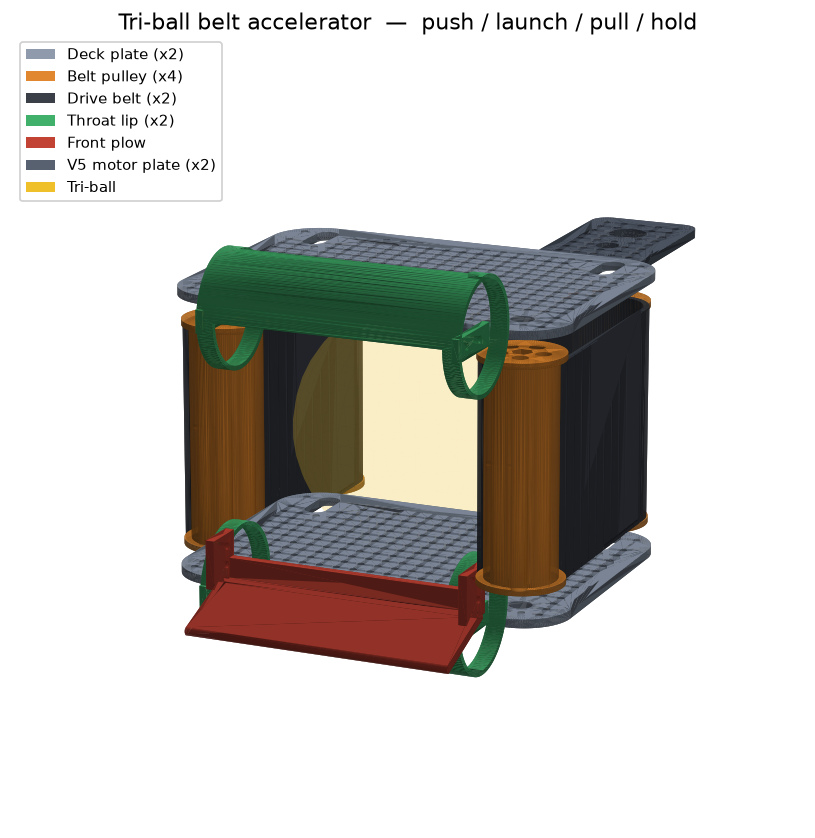

# RoomCleaner — 3D-Printed Parts (CAD)

Every printable part, as **parametric CadQuery scripts** that export genuine
**STEP** files (open in Fusion 360 / SolidWorks / FreeCAD / Onshape) and **STL**
files (ready to slice). The generated files are committed, so you can print
without installing anything.

```
cad/
  params.py         # ← edit YOUR dimensions here (shaft dia, line dia, servo…)
  parts/*.py        # one parametric script per part
  export_all.py     # regenerate everything + an assembled gripper preview
  lib.py            # STEP/STL export + PNG preview helper
  step/  stl/  previews/   # generated output (committed)
```

## Parts list

| Part | What it is | Print | Material |
|------|-----------|-------|----------|
| `winch_spool` | Drum the Dyneema winds onto; mounts on the motor shaft | ×4 | PLA/PETG |
| `motor_mount` | Cradles the gear motor in a ceiling corner | ×4 | PETG |
| `corner_guide` | U-bracket holding the corner pulley | ×4 | PETG |
| `effector_frame` | Hangs on the 4 cables; holds servo, camera, + strap slots for the ESP32 & LiPo (wireless claw) | ×1 | PETG |
| `tentacle_hub` | Disc carrying the ring of fingers; routes tendons | ×1 | PETG |
| `tentacle_finger` | Tendon-driven curling "tentacle" finger | ×5 | **TPU 95A** |
| `camera_mount` | Pi Camera bracket for the effector (close-up cam, Phase 4) | ×1 | PLA/PETG |
| `camera_mount_overhead` | Ceiling bracket for the innomaker 32×32 overhead cam | ×1 | PLA/PETG |

## The tri-ball belt accelerator — one mechanism, four behaviours

A **separate subsystem** from the ceiling gripper above: a VEX-standard **belt
accelerator** ("belt railgun"). The tri-ball runs down a barrel gripped between
two motor-driven **conveyor belts** on its **left and right** (the "rails"), with
**top + bottom decks** containing it and forming the floor it rides on. Like a
railgun it accelerates the ball *along* the barrel — but the rails are traction
belts, and belt **surface speed** is the exit speed. One drive gets **push /
launch / pull / hold** — replacing an intake **and** a puncher **and** a pusher
(fewer subsystems, less weight, faster cycle times).



| Mode | The belts… | …and the ball |
|------|------------|---------------|
| **PULL** (intake) | run inward, **slow** | friction draws the tri-ball into the barrel |
| **HOLD** (control) | **stopped** | ball pinched between the belts (compression grip) |
| **LAUNCH** | run outward, **fast** | ball spun up to belt speed and fired out the muzzle |
| **PUSH** | **off** | drive forward — the front plow shoves it through a contested zone |

Same two belts, three speeds/directions — plus a pure-drivetrain push. Because
exit speed ≈ belt surface speed, you don't chase a launch *impulse*; you set a
belt *speed* and the barrel length does the accelerating, which makes near/far
shots repeatable.

### Design basis (first principles)

The mechanism is sized from four relations, all parametric in `params.py`:

| Quantity | Relation | Set by |
|----------|----------|--------|
| Exit speed (no slip) | `v_exit ≈ v_belt = (RPM/60)·π·PULLEY_PITCH_DIA` | pulley Ø + motor RPM (gear-up) |
| Grip (no slip) | `μ·N ≥ m_ball·a` | `BALL_COMPRESSION` (normal force) |
| Channel gap | `BELT_GAP = TRIBALL_DIA − 2·BALL_COMPRESSION` | ball size + squeeze |
| Barrel length | accel distance to reach `v_belt` | `BARREL_LEN` |

Pick `PULLEY_PITCH_DIA` and motor RPM for the exit speed you want, `BALL_COMPRESSION`
for enough grip that the ball doesn't slip, and `BARREL_LEN` long enough that the
ball leaves at (near) belt speed. The side **belts squeeze** the ball
(`BELT_GAP < TRIBALL_DIA`) for grip, while the **top + bottom decks** are set a hair
wider than the ball (`2·SIDE_INNER_HALF > TRIBALL_DIA`) so it's captured but not
crushed and can't pop out top or bottom.

### Parts

| Part | What it is | Print | Material |
|------|-----------|-------|----------|
| `belt_pulley` | Flanged traction pulley, ½" hex bore, lightened — 2 drive + 2 idler | ×4 | PLA/PETG |
| `drive_belt` | The traction loop the ball rides on (best a COTS/urethane belt; TPU if printed) | ×2 | TPU 95A / COTS |
| `accel_plate` | Grid-perforated deck (top + bottom); 4 vertical pulley bores (rear = tension slots); **flip-symmetric** | ×2 | PLA/PETG |
| `throat_lip` | Smooth flared mouth — funnels on intake, guides a clean exit on launch | ×2 | PLA/PETG |
| `front_plow` | Raked push blade **and** front cross-brace, in one part | ×1 | PLA/PETG |
| `motor_plate` | V5 Smart Motor mount, geared up to a drive-pulley shaft (1.5" centre distance) | ×2 | PLA/PETG |

### Built to the VEX system

- **½" high-strength hex** bores on every pulley (`VEX_HEX_AF`); lock them on with
  shaft collars or the set-screw access hole.
- The **0.5" (12.7 mm) hole grid** fills each deck, so bearing flats, the throat
  lips, the plow, the V5 motors, and the drivetrain C-channel all bolt anywhere.
  The **rear pulley bores are tension slots** — slide the idlers back to tension
  each belt. Holes are **#8-32** clearance (`VEX_HOLE`).
- Sized for the VEX Over-Under **tri-ball** via `TRIBALL_DIA`. Tune
  `PULLEY_PITCH_DIA`, `BARREL_LEN`, `BELT_WIDTH`, `BALL_COMPRESSION`, and
  `SIDE_INNER_HALF` and re-run the export to fit a different element.

> The printed parts are the *custom* geometry (decks, pulleys, throat lips,
> plow). The motors, ½" hex shafts, bearing flats, gears, shaft collars, and the
> belts themselves are stock VEX / COTS — don't print those (print the belts in
> TPU only if you can't source a loop).

### Assembly

1. Snap a VEX **bearing flat** over each of the four pulley bores in each deck
   (front pair fixed; rear pair in the **tension slots**).
2. Stand a **belt pulley** on a **vertical ½" hex shaft** at each corner of the
   barrel — a front + rear pair on the left, a front + rear pair on the right —
   running between the top and bottom decks. Lock with shaft collars / set screws.
3. Loop a **drive belt** around each side's pulley pair (one belt left, one right);
   slide the rear idlers back in their slots to tension.
4. Bolt a **motor plate** on for each belt and gear the **V5 motor** up to that
   side's rear drive pulley (e.g. 12T→36T) for launch belt speed.
5. Bolt the two **throat lips** across the muzzle grid holes — one top, one bottom —
   to flare the mouth.
6. Bolt the **front plow** across the muzzle-floor grid holes — it also ties the two
   decks into a rigid frame.
7. Bolt the whole frame to your drivetrain C-channel through the grid.

## Regenerate after changing dimensions

Edit `cad/params.py` (especially `MOTOR_SHAFT_DIA`, `DYNEEMA_DIA`) then:

```bash
pip install -r requirements-cad.txt
python -m cad.export_all
```

## Print settings

- **Structural parts** (spool, motor mount, corner guide, frame, hub): **PETG**,
  0.2 mm layers, **4 walls**, **40–50% infill**. These carry real load.
- **Tentacle fingers**: **TPU 95A**, 0.2 mm, 3 walls, 15–20% infill. Lay each
  finger on its **flat dorsal (back) face** so the V-notches open upward — no
  supports. Slow down to ~20–30 mm/s for clean TPU.
- Most parts print support-free in the orientation described in each script's
  docstring.
- Tune `CLEARANCE` in `params.py` if press-fits are too tight/loose on your printer.

## Assembling the tentacle gripper

1. Bolt the **servo (MG996R)** into the `effector_frame` pocket, horn facing down.
2. Bolt the **tentacle_hub** under the frame (4× M3).
3. Insert each **tentacle_finger** base into a hub pocket; retain with one M3.
4. Thread one Dyneema/line **tendon** through each finger's channel, tie off at
   the tip, route the other end through the hub guide hole to the servo horn.
5. Tie all tendons to the horn so one servo sweep curls all fingers inward.
6. Tie the **four winch cables** to the four corner eyes of the frame.
7. Clip the **Pi Camera** (`camera_mount`) to the frame edge, facing down.

Mount fingers with their **notched (ventral) side facing inward** so they curl
toward the center and wrap the laundry.

## Heat-set inserts (brass threaded inserts)

`params.py` has `USE_HEATSET_INSERTS` (default **True**). It controls only the
holes where a screw threads **into printed plastic**:

- **Insert holes (widened to ~4 mm):** the 4 holes in `tentacle_hub` that bolt it
  up to the `effector_frame` — the joint carrying the whole gripper. Melt an M3
  insert into each with a soldering iron + insert tip, then bolt through the frame.
- **Left as clearance / screw-through:** most holes (frame, motor mount, corner
  guide) — screws pass through and thread into the motor/servo's own metal, or
  take a nut. No insert needed.
- **TPU parts stay self-tap / use a screw + nut:** heat-set inserts do **not** hold
  in flexible TPU, so the `tentacle_finger` base is not insert-drilled.

Set `USE_HEATSET_INSERTS = False` and re-run `python -m cad.export_all` if you'd
rather self-tap screws straight into the plastic (holes shrink to ~2.8 mm).

## ⚠️ Safety: do NOT print these

The **load-bearing ceiling anchors** (the eye screws / lag bolts into your
joists) must be **metal**, driven into solid wood — never a printed part. The
whole robot hangs from them. `motor_mount` and `corner_guide` bolt *to* those
metal anchors; the anchors themselves stay steel. Same for the emergency-stop
hardware.
