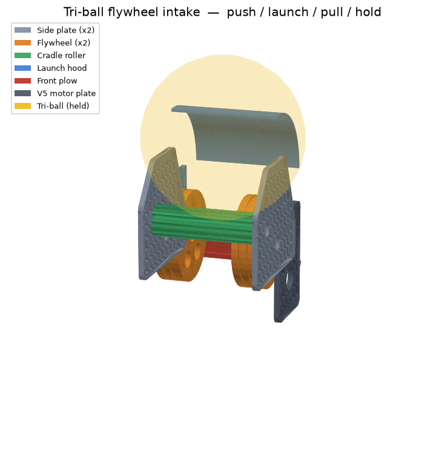

# RoomCleaner — 3D-Printed Parts (CAD)

Every printable part, as **parametric CadQuery scripts** that export genuine
**STEP** files (open in Fusion 360 / SolidWorks / FreeCAD / Onshape) and **STL**
files (ready to slice). The generated files are committed, so you can print
without installing anything.

```
cad/
  params.py         # ← edit YOUR dimensions here (shaft dia, line dia, servo…)
  parts/*.py        # one parametric script per part
  export_all.py     # regenerate everything + an assembled gripper preview
  lib.py            # STEP/STL export + PNG preview helper
  step/  stl/  previews/   # generated output (committed)
```

## Parts list

| Part | What it is | Print | Material |
|------|-----------|-------|----------|
| `winch_spool` | Drum the Dyneema winds onto; mounts on the motor shaft | ×4 | PLA/PETG |
| `motor_mount` | Cradles the gear motor in a ceiling corner | ×4 | PETG |
| `corner_guide` | U-bracket holding the corner pulley | ×4 | PETG |
| `effector_frame` | Hangs on the 4 cables; holds servo, camera, + strap slots for the ESP32 & LiPo (wireless claw) | ×1 | PETG |
| `tentacle_hub` | Disc carrying the ring of fingers; routes tendons | ×1 | PETG |
| `tentacle_finger` | Tendon-driven curling "tentacle" finger | ×5 | **TPU 95A** |
| `camera_mount` | Pi Camera bracket for the effector (close-up cam, Phase 4) | ×1 | PLA/PETG |
| `camera_mount_overhead` | Ceiling bracket for the innomaker 32×32 overhead cam | ×1 | PLA/PETG |

## The tri-ball flywheel intake — one mechanism, four behaviours

A **separate subsystem** from the ceiling gripper above: a VEX-standard flywheel
intake that gets **push / launch / pull / hold** out of a *single driven wheel*.
One motor stands in for an intake **and** a puncher **and** a pusher — fewer
subsystems, less weight, faster cycle times.



| Mode | The flywheel… | …and the ball |
|------|---------------|---------------|
| **PULL** (intake) | spins inward, **slow** | friction rolls the tri-ball up into the pocket |
| **HOLD** (control) | stalls / creeps | rests in the pocket, trapped by the hood + back roller |
| **LAUNCH** | spins **up to speed** | the *same wheel* throws it over the hood lip, across the field |
| **PUSH** | off | drive forward — the front plow shoves it through a contested zone |

The piece that makes one wheel do both intake and launch is the **launch hood**:
at low wheel speed its concave face keeps the ball trapped in the pocket (hold);
spin the wheel up and the ball carries enough energy to ride up and off the hood
lip (launch). Slide the hood's slotted flanges along the grid to trim the launch
angle for near vs. far shots. PUSH never runs the flywheel at all — it's pure
drivetrain, with the rigid frame + plow doing the work.

### Parts

| Part | What it is | Print | Material |
|------|-----------|-------|----------|
| `flywheel` | Heavy-rim driven wheel, ½" hex bore, traction-band grooves — the one wheel that pulls/holds/launches | ×2 | PLA/PETG |
| `intake_side_plate` | Grid-perforated scoop plate carrying both shaft bores; **flip-symmetric (one part, both sides)** | ×2 | PLA/PETG |
| `launch_hood` | Adjustable curved deflector — sets hold-vs-launch and the launch angle | ×1 | PLA/PETG |
| `cradle_roller` | Driven back roller, ½" hex bore, fluted — 2nd intake contact + pocket backstop | ×1 | PLA/PETG |
| `front_plow` | Raked push blade **and** front cross-brace, in one part | ×1 | PLA/PETG |
| `motor_plate` | V5 Smart Motor mount, geared up to the flywheel shaft (1.5" centre distance) | ×1 | PLA/PETG |

### Built to the VEX system

- **½" high-strength hex** bores on the flywheel and roller (`VEX_HEX_AF`); lock a
  wheel on with a shaft collar or the set-screw access hole.
- The **0.5" (12.7 mm) hole grid** perforates every plate, so a bearing flat, the
  hood, the plow, the V5 motor, and the drivetrain C-channel all bolt anywhere —
  and you re-pick bores to change gear ratio or geometry. Holes are **#8-32**
  clearance (`VEX_HOLE`).
- Sized for the VEX Over-Under **tri-ball** via `TRIBALL_DIA` in `params.py`. Tune
  `FLYWHEEL_DIA`, `FLYWHEEL_SPACING`, `HOOD_RADIUS`, and `PLATE_GAP` there and
  re-run the export to fit a different element or a tighter robot.

> The printed parts are the *custom* geometry (plates, hood, plow, flywheel core,
> roller). The motor, ½" hex shafts, bearing flats, gears, and shaft collars are
> stock VEX metal — don't print those.

### Assembly

1. Press a **½" hex shaft** through the flywheel bore of each side plate (snap a
   VEX **bearing flat** over each bore, screws on the flanking grid holes).
2. Slide the two **flywheels** onto the shaft, spaced `FLYWHEEL_SPACING` apart, and
   lock them with shaft collars / set screws. Wrap the rim grooves with traction
   bands (or press on flex-wheel tyres).
3. Mount the **cradle roller** on its hex shaft in the upper-back bores; band or
   gear it to the flywheel shaft so both spin together on intake.
4. Bolt the **motor plate** outboard of one side plate; gear the **V5 motor** up to
   the flywheel shaft (e.g. 12T→36T) for launch RPM.
5. Bolt the **launch hood** across the top-front grid holes; set its angle with the
   slotted flanges.
6. Bolt the **front plow** across the front-bottom grid holes — it also ties the
   two side plates into a rigid frame.
7. Bolt the whole frame to your drivetrain C-channel through the bottom grid row.

## Regenerate after changing dimensions

Edit `cad/params.py` (especially `MOTOR_SHAFT_DIA`, `DYNEEMA_DIA`) then:

```bash
pip install -r requirements-cad.txt
python -m cad.export_all
```

## Print settings

- **Structural parts** (spool, motor mount, corner guide, frame, hub): **PETG**,
  0.2 mm layers, **4 walls**, **40–50% infill**. These carry real load.
- **Tentacle fingers**: **TPU 95A**, 0.2 mm, 3 walls, 15–20% infill. Lay each
  finger on its **flat dorsal (back) face** so the V-notches open upward — no
  supports. Slow down to ~20–30 mm/s for clean TPU.
- Most parts print support-free in the orientation described in each script's
  docstring.
- Tune `CLEARANCE` in `params.py` if press-fits are too tight/loose on your printer.

## Assembling the tentacle gripper

1. Bolt the **servo (MG996R)** into the `effector_frame` pocket, horn facing down.
2. Bolt the **tentacle_hub** under the frame (4× M3).
3. Insert each **tentacle_finger** base into a hub pocket; retain with one M3.
4. Thread one Dyneema/line **tendon** through each finger's channel, tie off at
   the tip, route the other end through the hub guide hole to the servo horn.
5. Tie all tendons to the horn so one servo sweep curls all fingers inward.
6. Tie the **four winch cables** to the four corner eyes of the frame.
7. Clip the **Pi Camera** (`camera_mount`) to the frame edge, facing down.

Mount fingers with their **notched (ventral) side facing inward** so they curl
toward the center and wrap the laundry.

## Heat-set inserts (brass threaded inserts)

`params.py` has `USE_HEATSET_INSERTS` (default **True**). It controls only the
holes where a screw threads **into printed plastic**:

- **Insert holes (widened to ~4 mm):** the 4 holes in `tentacle_hub` that bolt it
  up to the `effector_frame` — the joint carrying the whole gripper. Melt an M3
  insert into each with a soldering iron + insert tip, then bolt through the frame.
- **Left as clearance / screw-through:** most holes (frame, motor mount, corner
  guide) — screws pass through and thread into the motor/servo's own metal, or
  take a nut. No insert needed.
- **TPU parts stay self-tap / use a screw + nut:** heat-set inserts do **not** hold
  in flexible TPU, so the `tentacle_finger` base is not insert-drilled.

Set `USE_HEATSET_INSERTS = False` and re-run `python -m cad.export_all` if you'd
rather self-tap screws straight into the plastic (holes shrink to ~2.8 mm).

## ⚠️ Safety: do NOT print these

The **load-bearing ceiling anchors** (the eye screws / lag bolts into your
joists) must be **metal**, driven into solid wood — never a printed part. The
whole robot hangs from them. `motor_mount` and `corner_guide` bolt *to* those
metal anchors; the anchors themselves stay steel. Same for the emergency-stop
hardware.
